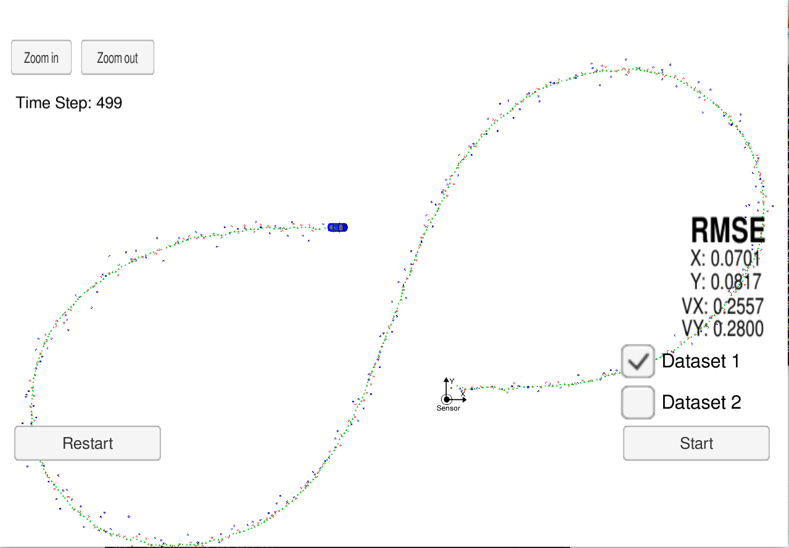

# Unscented Kalman Filter Project
Self-Driving Car Engineer Nanodegree Program

## Overview

In this project, I used C++ to implemented Unscented Kalman Filter to achieve prediction and measurement of position by data acquired from Lidar and Radar. Compared with Extended Kalman Filter, Unscented Kalman Filter should have higher accuracy. 

## Environment Setup
Assume that you have already install all Dependencies tools: 
1. mkdir build
2. cd build
3. cmake ..
4. make
5. ./UnscentedKF

## Initilization 
Apart from implementing Unscented Kalman Filter algorithm in the project, Initilization parameter is a key part to lower RMSE.
  * std_a_:  representing longitudinal acceleration nosie in m/s^2. I set the value on 1.5, which is reasonable for acceleration of bike.
  * std_yawdd_: representing yaw acceleration noise in radians/s^2. the value I set is 0.5.
  * X_ : px, py is based on the first radar or lidar measurment. And v is set on 3 becauase of common sense on bike'speed. I tried different values set on yaw and yawd and settle yaw to 1.1 and yawd to 0.1.
  * P_ : I set the matrix in following: 
       <pre>  0.15       0      0       0      0
         0    0.15      0       0      0
         0       0      1       0      0
         0       0      0       1      0
         0       0      0       0      1]

## Result

The Final RMSE is

| Parameter                        |     RMSE                       |
|:---------------------:|:---------------------------------------------:|
| Px                 | 0.0701                                  |
| Py             | 0.0817 |
| Vx         | 0.2557   |
| Vy     | 0.2800  |

## Result

The Final RMSE is

| Parameter                        |     RMSE                       |
|:---------------------:|:---------------------------------------------:|
| Px                 | 0.0701                                  |
| Py             | 0.0817 |
| Vx         | 0.2557   |
| Vy     | 0.2800  |
